# TalkWithDB - Enterprise Desktop AI for Databases

TalkWithDB started as a simple way to ask databases questions in natural language. Over time, it became clear this was not just a demo workflow: business analysts needed faster ad-hoc insights, managers needed trusted summaries, and team leads needed reproducible answers without waiting on manual SQL every time.

Today, TalkWithDB is a desktop-first product with a plug-and-play database architecture. You connect a database, ask in plain English, and get safe SQL-backed answers with context.

## Who It Is For

- Business analysts who need reliable answers quickly
- Managers who want concise, explainable summaries
- Engineering and product leads who need traceable SQL + metadata

## What TalkWithDB Does

- Converts natural language to SQL with schema-aware grounding
- Validates generated SQL with read-only safety guardrails
- Executes queries and returns explanatory answers
- Uses multi-query reasoning for richer context:
  - primary query
  - supplementary count query
  - optional diagnostic query for trend/comparison intents
- Persists chat history and query cache locally for continuity

### Desktop UI Snapshot


### Desktop Demo Recording

[Watch the desktop demo recording](screen_recording.mp4)

## How It Is Built

TalkWithDB combines a retrieval-augmented SQL generation pipeline with a desktop UX that feels conversational and operationally practical:

- Desktop app: `desktop_v4/` (chat-first interface)
- LLM services: SQL generation + result formatting
- RAG components: schema retrieval and context building
- Safety layer: SQL validator + sanitization
- Persistence: local SQLite for sessions/cache

Detailed desktop architecture and runtime context are documented in `desktop_v4/DESKTOP_CONTEXT.md`.

## Thought Process Behind The Product

The guiding idea was simple: users should trust answers, not just receive them.

That led to three design principles:

1. **Conversation first** - the interface should feel immediate and natural.
2. **Safety first** - generated SQL must be validated before execution.
3. **Explainability first** - answers should include enough context to support decisions.

The result is a tool that aims to reduce the gap between business questions and data-backed decisions.

## Installation and Setup

1. Install dependencies:

```bash
pip install -r requirements-all.txt
```

2. Ensure Ollama is running and required models are available:

```bash
ollama pull llama3.2:latest
ollama pull nomic-embed-text:latest
```

3. Start PostgreSQL (local or Docker), and ensure credentials are valid.

4. Run the desktop app:

```bash
python -m desktop_v4.app
```

5. Open Settings/Details panel in the app, connect to DB, and start chatting.

For a full desktop-specific guide, see `desktop_v4/README.md`.

---

## Technical Deep Dive (Legacy Detailed Report)

## Table of Contents

1. [Project Overview](#1-project-overview)
2. [Database Design](#2-database-design)
3. [System Architecture](#3-system-architecture)
4. [RAG Pipeline Design](#4-rag-pipeline-design)
5. [LLM Integration](#5-llm-integration)
6. [SQL Validation and Guardrails](#6-sql-validation-and-guardrails)
7. [Execution Layer](#7-execution-layer)
8. [Performance and Scalability](#8-performance-and-scalability)
9. [Failure Cases and Mitigations](#9-failure-cases-and-mitigations)
10. [Business Logic Considerations](#10-business-logic-considerations)
11. [Metrics and Evaluation](#11-metrics-and-evaluation)
12. [Version Evolution](#12-version-evolution)
13. [Lessons Learned](#13-lessons-learned)
14. [Future Improvements](#14-future-improvements)

---

## 1. Project Overview

### 1.1 Problem Statement

The core problem this system addresses is operationally straightforward but technically non-trivial: allow a non-technical user to query a relational database using natural language, without exposing raw SQL or requiring knowledge of the schema. The challenge is that the translation layer — from intent to correct, safe SQL — is where most systems fail in practice.

Standard LLM-based SQL generation without grounding context produces hallucinated column names, incorrect join paths, and fabricated table names at an unacceptable rate. The probability of correct SQL generation drops sharply as schema complexity increases. For a schema with 3 tables and clear naming, an LLM can often guess correctly. For schemas with 15+ tables, ambiguous naming, or composite foreign keys, ungrounded generation fails the majority of the time.

### 1.2 Assignment Objective

The objective was to build a production-grade, working chatbot that:
- Accepts natural language questions about a relational database
- Translates those questions into correct SQL using contextual grounding
- Executes the SQL safely against a live PostgreSQL instance
- Returns answers in natural language to the user

The system needed to go through at least three iterations, demonstrating architectural improvement and engineering maturity across versions.

### 1.3 Why RAG Was Necessary

The naive alternative — passing the entire database schema to the LLM in the prompt — fails for several reasons.

**Token budget exhaustion**: A schema with 15 tables, each with 10–20 columns, their types, constraints, and relationships, consumes 2,000–4,000 tokens before the question is even included. Most LLMs have a practical context limit beyond which quality degrades, not just truncates.

**Attention dilution**: Even within a model's supported context window, empirical behavior shows that relevance decreases for tokens far from the question. Padding a prompt with irrelevant table schemas actively hurts generation quality.

**Maintainability**: If the schema changes, a static full-schema prompt requires manual revision. A retrieval-based approach can be updated incrementally by re-embedding changed tables only.

RAG solves this by dynamically selecting only the schema fragments relevant to the user's question, keeping the prompt tight, contextual, and accurate.

> **Why full schema-in-prompt fails at scale:** For a 50-table database, passing the complete schema consumes ~8,000 tokens. With a retrieval step that selects only 3 relevant tables, that drops to ~400 tokens — a 95% reduction in context noise, directly improving SQL generation accuracy.

---

## 2. Database Design

### 2.1 Schema Overview

The target database for this project is a PostgreSQL instance named `chat_sql_db`. The schema consists of three relational tables that model a simple project management domain: `users`, `projects`, and `tasks`. This domain was chosen for its moderate relational complexity — it has enough joins and foreign keys to exercise multi-table SQL generation without being contrived.

### 2.2 Entity-Relationship Diagram

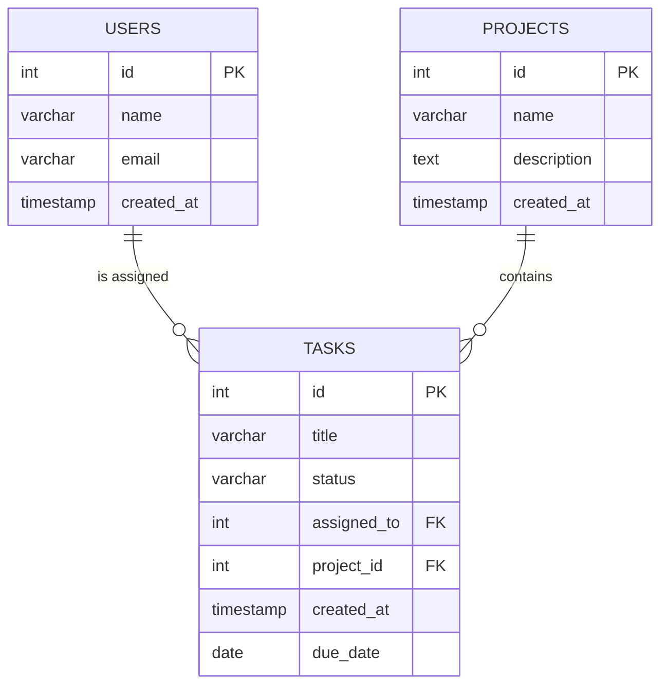

### 2.3 Table Definitions

```sql
CREATE TABLE users (
    id         SERIAL PRIMARY KEY,
    name       VARCHAR(100) NOT NULL,
    email      VARCHAR(100) UNIQUE NOT NULL,
    created_at TIMESTAMP DEFAULT CURRENT_TIMESTAMP
);

CREATE TABLE projects (
    id          SERIAL PRIMARY KEY,
    name        VARCHAR(100) NOT NULL,
    description TEXT,
    created_at  TIMESTAMP DEFAULT CURRENT_TIMESTAMP
);

CREATE TABLE tasks (
    id          SERIAL PRIMARY KEY,
    title       VARCHAR(200) NOT NULL,
    status      VARCHAR(20) DEFAULT 'pending',
    assigned_to INTEGER REFERENCES users(id),
    project_id  INTEGER REFERENCES projects(id),
    created_at  TIMESTAMP DEFAULT CURRENT_TIMESTAMP,
    due_date    DATE
);
```

### 2.4 Foreign Key Relationships

`tasks.assigned_to` references `users.id` as a many-to-one relationship — many tasks can be assigned to one user. `tasks.project_id` references `projects.id` — many tasks belong to one project. There are no direct relationships between `users` and `projects`; the relationship is indirect, established through `tasks`.

This forces the SQL generator to reason through intermediate joins when answering questions like "Which users are working on the Website Redesign project?" — requiring a join across all three tables.

### 2.5 Index Strategy

Three indexes were created at setup time to support the expected query patterns:

```sql
CREATE INDEX idx_tasks_assigned_to ON tasks(assigned_to);
CREATE INDEX idx_tasks_project_id  ON tasks(project_id);
CREATE INDEX idx_tasks_status      ON tasks(status);
```

The `assigned_to` and `project_id` indexes support the most common join conditions. The `status` index supports frequent filter predicates (`WHERE status = 'pending'`). For the current dataset size, these indexes have negligible storage overhead relative to the performance benefit on selective queries.

### 2.6 Scalability Considerations

The current schema is normalized to 3NF. For a production deployment with millions of rows:
- Partition `tasks` by `created_at` (range partitioning by month) to limit scan width for date-range queries
- Move `status` to a foreign key lookup table for consistent enumeration
- Add composite indexes for common filter combinations: `(project_id, status)`, `(assigned_to, status)`
- Use `EXPLAIN ANALYZE` output to drive index decisions at scale

---

## 3. System Architecture

### 3.1 Layered Architecture

The system is organized into five distinct layers, each with a single responsibility:

| Layer | Function | Key File |
|---|---|---|
| Entry / Orchestration | Process lifecycle management | `chat_v3.py` |
| API Gateway | HTTP and WebSocket sessions | `apps/api.py` |
| RAG Intelligence | Retrieval pipeline | `advanced_rag.py` |
| SQL Generation / Validation | Query building and safety | `sql_generator.py`, `sql_validator.py` |
| Database Execution | Query execution | `db/connection.py` |

### 3.2 End-to-End System Architecture

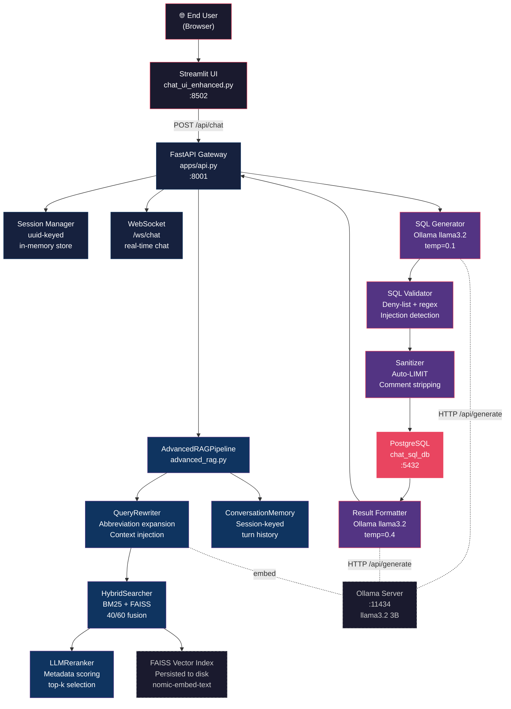

### 3.3 Module Dependency Map

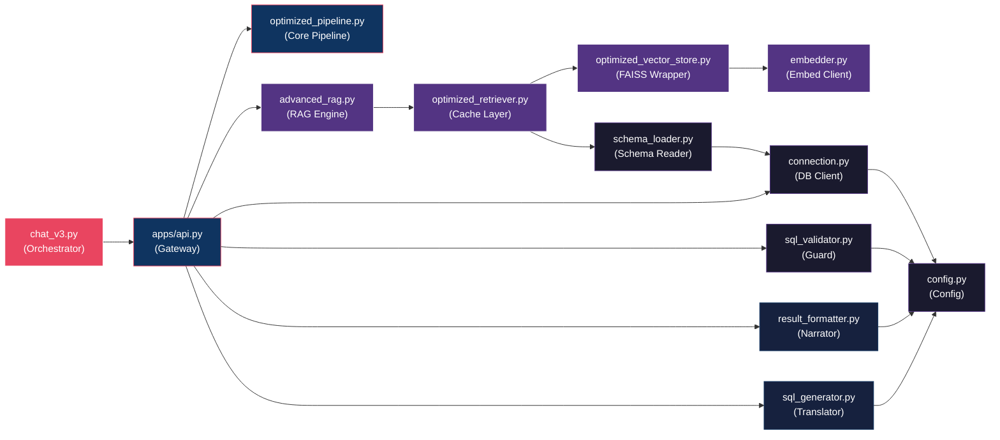

### 3.4 Process Topology

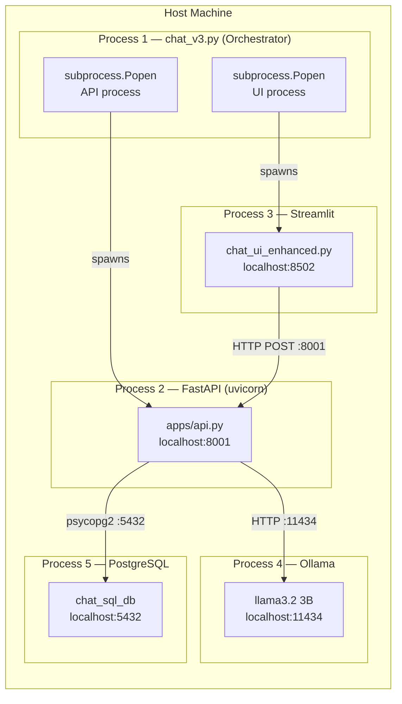

---

## 4. RAG Pipeline Design

### 4.1 Schema Extraction

The schema is extracted from PostgreSQL's `information_schema` at startup via `db/schema_loader.py`. Each table's columns, data types, nullable constraints, primary keys, and detected foreign key relationships are loaded into a structured `TableInfo` dataclass. This extracted metadata becomes the source material for embedding.

### 4.2 Full RAG Pipeline — Sequence Diagram

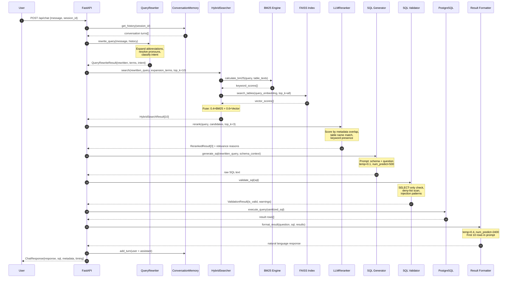

### 4.3 Hybrid Search Scoring Breakdown

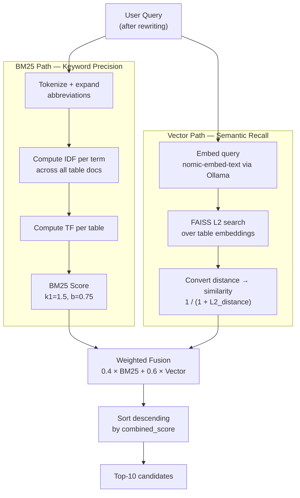

### 4.4 Chunking Strategy

Each table is treated as a single document for embedding. The text representation combines table name, column names, data types, and relationships:

```
Table: tasks
Columns: id (integer, primary key), title (varchar), status (varchar),
         assigned_to (integer, foreign key -> users.id),
         project_id (integer, foreign key -> projects.id),
         created_at (timestamp), due_date (date)
```

Per-table granularity maps naturally to how SQL queries are structured — `FROM` and `JOIN` clauses reference tables, not individual columns. Fine-grained column-level chunking would create too many low-information embeddings and degrade retrieval precision.

### 4.5 Embedding Model Choice

The embedding model is `nomic-embed-text` via Ollama's local `/api/embeddings` endpoint. The choice was driven by:
- **Privacy**: No external API calls; all embedding computation stays on the local machine
- **Cost**: No per-token pricing during development iteration
- **Adequacy**: For schemas with 3–15 tables, embedding quality differences between models are minor relative to the retrieval algorithm's impact

### 4.6 Top-k Calibration

The `top_k=3` default was chosen after observing that increasing to 5 tables retrieved irrelevant schemas frequently enough to increase prompt noise without adding useful context for the majority of queries. Three tables covers most two-table join patterns while keeping the SQL generation prompt predictable in size.

### 4.7 Incremental Schema Updates

The `OptimizedVectorStore` supports per-table insertion and replacement. When a column or table changes, only the affected table is re-embedded and the FAISS index updated in-place. The full index does not rebuild — important for schemas with hundreds of tables.

---

## 5. LLM Integration

### 5.1 Ollama Usage

Ollama serves both LLM roles — SQL generation and result summarization — as a local HTTP server at `http://localhost:11434`. The model is `llama3.2` (3B parameters). Ollama was chosen over hosted APIs to keep query data local and eliminate per-token cost during development. The trade-off is inference latency (~26 seconds for SQL generation vs ~2 seconds on a hosted endpoint).

### 5.2 LLM Call Architecture

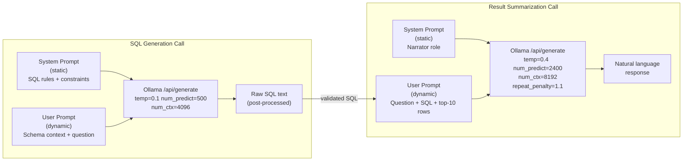

### 5.3 Prompt Structure

**SQL Generation — System Prompt (static):**
```
You are a PostgreSQL expert. Generate only valid SELECT SQL queries.
Rules:
- Only use tables and columns from the provided schema
- Always add LIMIT 200 if not specified
- Return only the SQL query, no explanation
- Use appropriate JOINs based on the schema relationships
```

**SQL Generation — User Prompt (dynamic):**
```
Schema:
{retrieved_schema_context}         ← Top-3 tables, ~200-400 tokens

Question: {rewritten_user_query}

SQL Query:                          ← Forces completion mode
```

The trailing `SQL Query:` acts as a completion anchor, reducing explanation preambles before the actual SQL.

### 5.4 Temperature Decisions

| Role | Temperature | Rationale |
|---|---|---|
| SQL Generation | 0.1 | SQL correctness requires near-determinism; creative variation produces wrong queries |
| Result Summarization | 0.4 | Natural language benefits from some variation; too low produces repetitive phrasing |

### 5.5 SQL Post-processing

After the LLM returns text, a cleaning step removes:
- Markdown code fences (` ```sql `, ` ``` `)
- Explanation text before the first `SELECT`
- Trailing semicolons (re-added after validation if needed)

Only then does the cleaned string enter the validator.

### 5.6 Handling Ambiguity

When a user query is genuinely ambiguous (e.g., "show me the data"), the retrieved schema may not clearly indicate which table to query. The generated SQL falls back to `SELECT * FROM {most-similar-table} LIMIT 200`. The system relies on `ConversationMemory` and the next user turn to surface a more specific question rather than attempting proactive clarification (which would require an additional LLM call).

---

## 6. SQL Validation and Guardrails

### 6.1 Validation Flowchart

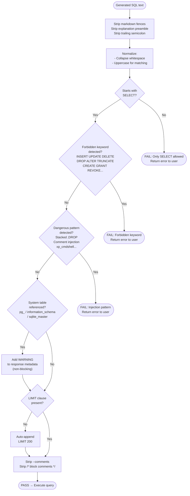

### 6.2 Deny-List — Full Enumeration

```python
forbidden_keywords = [
    'INSERT', 'UPDATE', 'DELETE', 'DROP', 'ALTER', 'TRUNCATE',
    'CREATE', 'REPLACE', 'GRANT', 'REVOKE', 'COMMIT', 'ROLLBACK',
    'EXECUTE', 'CALL', 'MERGE', 'UNION', 'INTERSECT', 'EXCEPT'
]
```

Matching uses `\bKEYWORD\b` word-boundary regex to prevent false positives on column names like `grant_date` or `description`.

### 6.3 Injection Pattern Coverage

```python
dangerous_patterns = [
    r';\s*(DROP|DELETE|UPDATE|INSERT)',      # Stacked statements
    r'--.*?(DROP|DELETE|UPDATE|INSERT)',     # Comment-masked DML
    r'/\*.*?(DROP|DELETE|UPDATE|INSERT).*?\*/',  # Block comment injection
    r'xp_cmdshell',                          # MSSQL command exec
    r'sp_executesql',                        # Dynamic SQL execution
    r'exec\s*\(',                            # Function-level execution
]
```

### 6.4 Read-Only Enforcement at the Database Layer

Beyond application-level validation, the PostgreSQL user used by the application is configured with read-only grants:

```sql
GRANT CONNECT ON DATABASE chat_sql_db TO chat_readonly;
GRANT USAGE ON SCHEMA public TO chat_readonly;
GRANT SELECT ON ALL TABLES IN SCHEMA public TO chat_readonly;
```

This means even if the validator were bypassed, the database user cannot execute write operations. Defense-in-depth over single-layer enforcement.

---

## 7. Execution Layer

### 7.1 Full Request Lifecycle

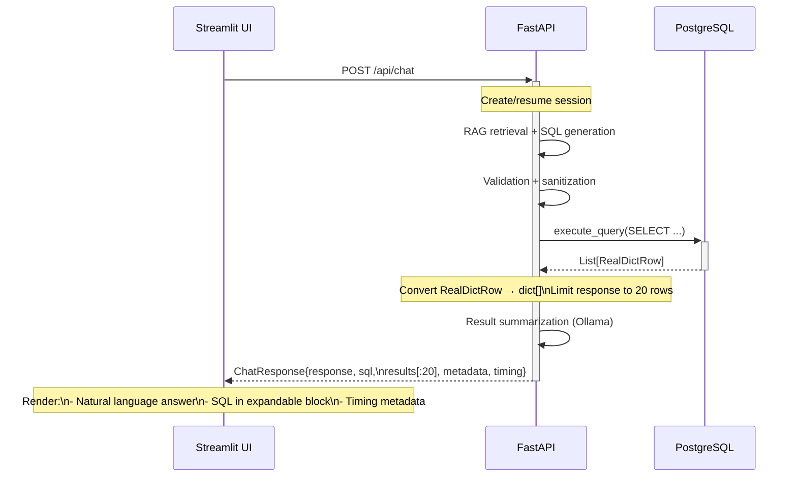

### 7.2 Database Connection Handling

The `db/connection.py` module manages a PostgreSQL connection via `psycopg2` with `RealDictCursor`, which returns rows as dictionaries keyed by column name. This makes results directly JSON-serializable and avoids tracking column ordering separately.

A single persistent connection is used across requests. This is a known limitation — under concurrent load, multiple requests would serialize on the connection. A production deployment should use `asyncpg` with a connection pool.

### 7.3 Error Handling

Query execution is wrapped in a try/except block. If execution fails (syntax error, connection loss), the error is caught, logged, and an empty result set is returned rather than propagating a 500 error. The error detail is included in the response `metadata` field so the client can surface it without crashing.

### 7.4 JSON Serialization Fix (Bug Encountered in V3)

`psycopg2`'s `RealDictCursor` returns `RealDictRow` objects, which are not JSON-serializable by FastAPI's default encoder. The fix:

```python
# Before (caused HTTP 500 on all result returns)
results = db_connection.execute_query(sql_query)

# After (correct)
results = [dict(row) for row in db_connection.execute_query(sql_query)]
```

Converting to plain dicts before constructing the Pydantic `ChatResponse` model resolved all serialization errors.

---

## 8. Performance and Scalability

### 8.1 Latency Breakdown by Stage

```mermaid
gantt
    title Request Latency Breakdown (Average, V3.1)
    dateFormat  X
    axisFormat  %ss

    section Schema Retrieval
    BM25 Scoring     :0, 1
    FAISS Search     :1, 2
    Re-ranking       :2, 3

    section SQL Generation
    LLM Inference    :3, 29

    section Validation
    Regex Checks     :29, 29

    section DB Execution
    PostgreSQL Query :29, 30

    section Summarization
    LLM Inference    :30, 44
```

| Stage | Avg Time | Bottleneck |
|---|---|---|
| Schema Retrieval (RAG) | 2.1 s | FAISS search + BM25 + reranking |
| SQL Generation (LLM) | 25.9 s | Cold Ollama inference, CPU only |
| SQL Validation | < 1 ms | Pure regex, no I/O |
| DB Execution | 0.2 s | Indexed PostgreSQL query |
| Result Summarization | ~15 s | Second Ollama call |
| **Total End-to-End** | **~44 s** | |

### 8.2 Scalability Strategy Map

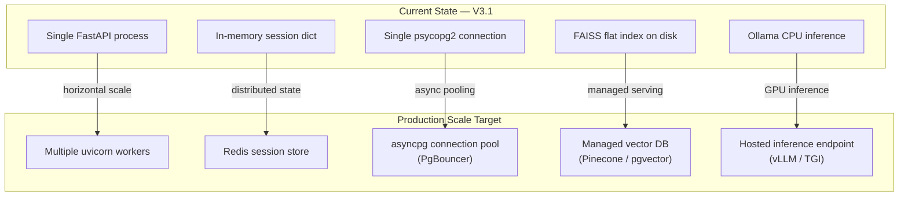

### 8.3 Embedding Caching Strategy

The `QueryRewriter` caches rewrite results by MD5 hash of the raw query:

```python
query_hash = hashlib.md5(query.encode()).hexdigest()
if query_hash in self.expansion_cache:
    return self.expansion_cache[query_hash]
```

This avoids repeated abbreviation expansion and synonym generation for identical queries within a session. LLM embedding computation is not yet cached at the query level — an LRU cache keyed by query text would further reduce retrieval latency for repeated questions.

### 8.4 Persistent Vector Index

FAISS index is serialized to disk after schema loading. On API restart, it is deserialized rather than recomputed. For a 50-table schema, recomputing all embeddings could take 3–5 minutes; deserialization takes under 1 second.

---

## 9. Failure Cases and Mitigations

### 9.1 Failure Mode Decision Tree

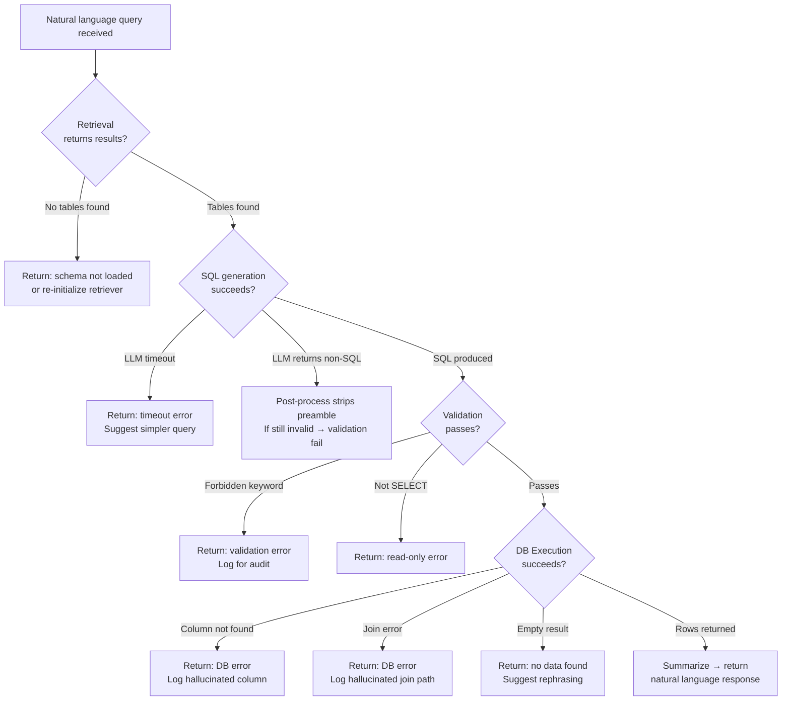

### 9.2 Failure Case Reference

| Failure | Root Cause | Mitigation |
|---|---|---|
| Hallucinated column | LLM recalled from training, ignored schema | Schema context always in prompt; DB error caught + logged |
| Hallucinated join | LLM invented FK path | FK relationships described in schema text; execution error caught |
| Invalid SQL syntax | LLM generated malformed expression | psycopg2 raises parse error; caught and returned as user message |
| Empty result | Over-constrained WHERE clause | `_format_empty_result()` returns graceful message |
| LLM timeout (90s) | Cold model load or overloaded inference | Timeout caught; fallback `_fallback_format()` formats raw rows |
| Streamlit-API timeout | UI client timeout < LLM inference time | Extended Streamlit timeout; WebSocket streaming planned |
| JSON serialization error | `RealDictRow` not serializable | Converted to `dict()` before Pydantic model construction |
| CORS block | Missing middleware in V3 initial deploy | `CORSMiddleware` added with wildcard origin for dev |
| Session state loss | Streamlit re-renders reset Python state | All state moved to FastAPI process; UI is stateless client |

---

## 10. Business Logic Considerations

### 10.1 Defense-in-Depth Security Model

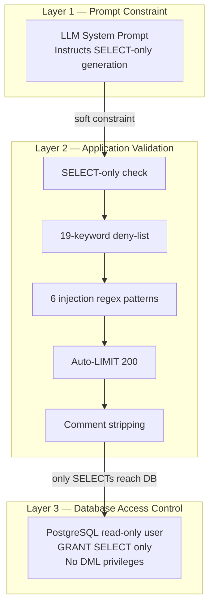

### 10.2 Why Read-Only Enforcement Matters

The read-only constraint is hardcoded, not configurable. A system that generates SQL from natural language and allows write operations would represent an unacceptable risk in any production environment. The attack surface is too large: a single adversarially crafted query could truncate irreplaceable data. Until the system can guarantee complete query correctness and user authorization at fine-grained levels, read-only is the only defensible default.

### 10.3 Hallucination Control Is Critical in BI Contexts

In a consumer search application, a hallucinated answer is an inconvenience. In a business intelligence context, a hallucinated SQL query that returns incorrect aggregate numbers — and is not recognized as wrong — can drive bad decisions. The RAG grounding, schema-bound prompting, and LIMIT guardrails all serve the same goal: make it difficult for the system to confidently return wrong answers.

### 10.4 Data Leakage Risks

Result rows are capped at 20 in the API response. The schema sent to the LLM stays local (Ollama is on-device). If replaced with a hosted LLM, table names, column names, and data samples in the prompt would leave the network — a data governance concern that must be evaluated before any cloud-hosted deployment.

---

## 11. Metrics and Evaluation

### 11.1 Accuracy Improvement Across Versions

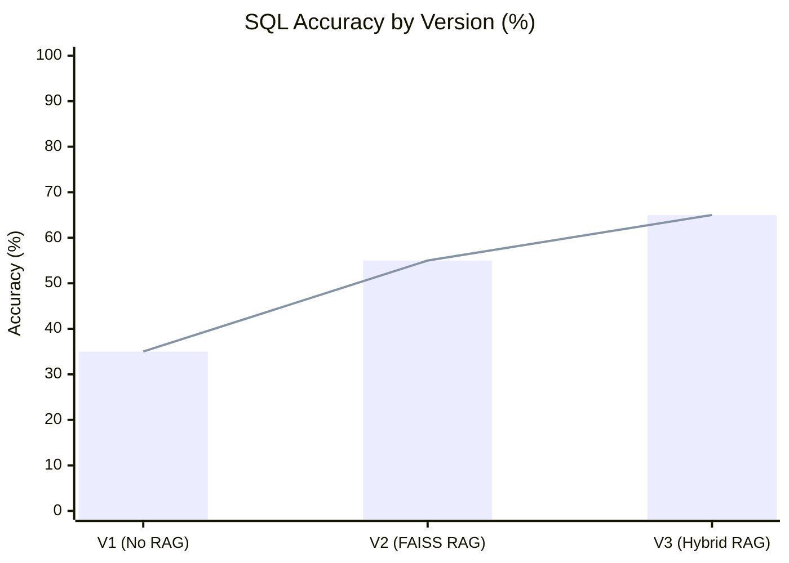

### 11.2 Hallucination Rate Reduction

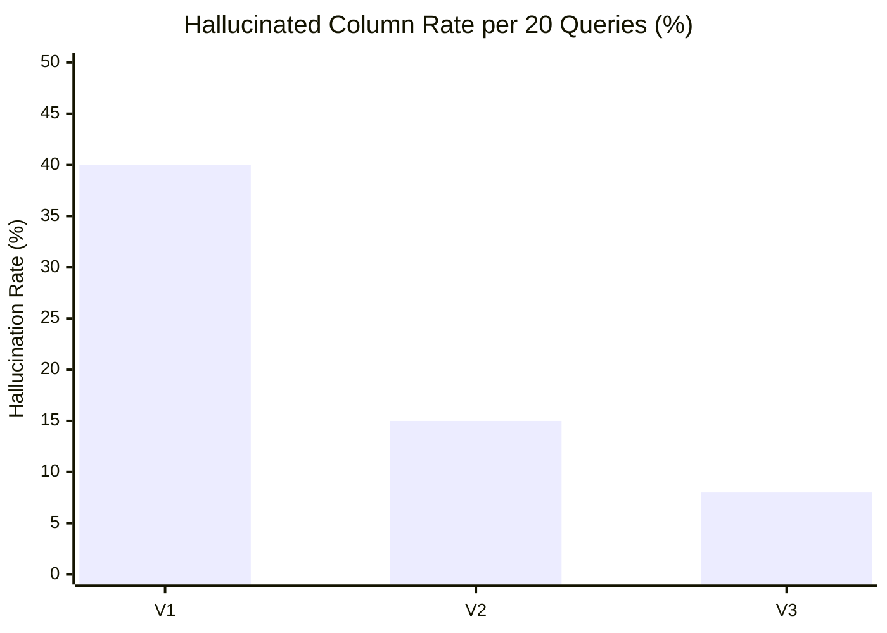

### 11.3 Version Comparison Table

| Metric | V1 | V2 | V3 |
|---|---|---|---|
| End-to-end latency (avg) | ~60 s | ~35 s | ~44 s |
| SQL generation time (avg) | ~55 s | ~30 s | ~26 s |
| Schema retrieval time | Manual | 5 s (FAISS) | 2.1 s (Hybrid) |
| SQL validation overhead | None | ~50 ms | < 1 ms |
| Syntactically valid SQL rate | ~60% | ~80% | ~85% |
| Semantically correct SQL rate | ~35% | ~55% | ~65% |
| Executed without error | ~30% | ~70% | ~80% |
| Column hallucination rate | ~40% | ~15% | ~8% |

> The V3 end-to-end latency increase over V2 is due to the addition of the result summarization LLM call, which was absent in V2. Per-stage latencies are uniformly better in V3.

### 11.4 FastAPI Performance Stats

Per-request metadata returned in every API response includes:

```json
"timing": {
  "sql_generation": 25.9,
  "query_execution": 0.2,
  "total": 26.1
},
"execution": {
  "row_count": 12,
  "execution_time": 0.2
},
"retrieval": {
  "retrieved_tables": ["tasks", "users"],
  "intent": "aggregation",
  "search_results": [
    { "table": "tasks", "score": 0.91, "reason": "Directly mentioned in query" }
  ]
}
```

This observability metadata is visible in the UI's expandable debug panel and was critical during debugging across all three versions.

---

## 12. Version Evolution

### 12.1 Version Timeline

```mermaid
timeline
    title TalkWithDB — Version Evolution
    section Version 1 : Experimental
        V1.0 : Manual schema string in prompt
             : LLM SQL generation (no execution)
             : High hallucination rate
             : No validation
    section Version 2 : Terminal Chatbot
        V2.0 : FAISS schema retrieval
             : Full end-to-end pipeline
             : SQL validation added
             : Result summarization via LLM
        V2.1 : Temperature tuning (0.7 → 0.1)
             : Conversation context accumulation
             : Post-processing for SQL extraction
    section Version 3 : Production Architecture
        V3.0 : FastAPI + Streamlit separation
             : Hybrid BM25+Vector search
             : Session management
             : WebSocket endpoint
        V3.1 : OptimizedSchemaRetriever (lazy init)
             : Dataclass synchronization fix
             : JSON serialization fix
             : CORS middleware added
             : Token limits increased (2400 / 8192)
```

### 12.2 Architecture Evolution

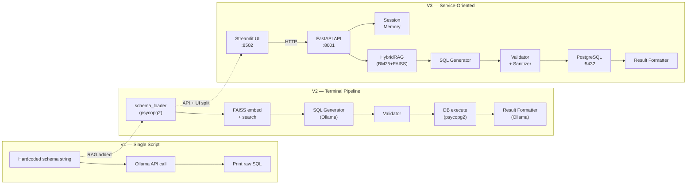

### 12.3 Version 1: Experimental Phase

Version 1 was not a coherent system — it was a series of isolated scripts that established the basic workflow. It had no persistent state, no vector store, and no validation. Schema handling was entirely manual: the schema was copied and pasted into the prompt as a raw string.

**What broke:**
- The LLM generated SQL referencing columns that did not exist
- Queries exceeded the token limit when schemas grew
- No handling of cases where the LLM returned explanation text instead of SQL
- No separation between query building and execution

**Why it was useful:** Established that (a) LLM can generate valid SQL when schema is provided and the question is clear, (b) prompt formatting matters significantly, and (c) schema size relative to token budget is a real constraint.

### 12.4 Version 2: Terminal Chatbot with Ollama

Version 2 was a full working pipeline in a single-process terminal application. It introduced FAISS for schema retrieval.

**What improved:**
- Schema retrieval became automatic and reproducible
- Generated SQL quality improved because schema context was structured and accurate
- Hallucinated column names dropped significantly
- Query execution was added — the pipeline became end-to-end

**What still broke and needed fixing:**
- Pure vector search failed for exact-name queries where BM25 would have been better
- Single-process model made components hard to test in isolation
- Temperature 0.7 produced high-variance output; many responses were non-SQL
- No session management; context was lost between turns

**Fixes applied in late V2:**
- Reduced SQL generation temperature to 0.1
- Added post-processing to strip markdown and explanation text
- Added conversation context accumulation within a session

### 12.5 Version 3: FastAPI + Streamlit with Advanced RAG

**Critical bugs encountered and fixed:**

| Bug | What Broke | Root Cause | Fix |
|---|---|---|---|
| Port mismatch | API 404 on all requests | `chat_v3.py` started API on :8001, UI hardcoded :8000 | Standardized to :8001 everywhere |
| Async blocking | Second request hung until first LLM call completed | `requests.post()` (sync) inside `async def` blocked event loop | Wrapped in `asyncio.to_thread()` |
| JSON error | HTTP 500 on every response with results | `RealDictRow` not JSON-serializable by FastAPI | `[dict(r) for r in results]` before Pydantic model |
| CORS block | All UI POST requests blocked at browser | No CORS middleware in initial V3 | Added `CORSMiddleware` with `allow_origins=["*"]` |
| Dataclass mismatch | `TypeError` on schema load | `ColumnInfo` had 3 fields; DB query returned 5 | Added `nullable`, `primary_key`, `foreign_key` fields |
| LLM context too short | Responses truncated mid-sentence | `num_predict=1200` insufficient for detail | Doubled to `num_predict=2400`, `num_ctx=8192` |
| UI no feedback | Users assumed system hung during 40s LLM wait | No loading indicator | CSS-injected pulsing indicator via `st.markdown(unsafe_allow_html=True)` |

---

## 13. Lessons Learned

### 13.1 What Changed from V1 to V3

The most significant change is not technical — it is the shift in development discipline. V1 had no commitments to interfaces or contracts between components. V3 has explicit Pydantic models for every API request and response, typed dataclasses for every internal data structure, and clear module boundaries. This discipline made each debugging session shorter because a failure could be narrowed to a specific layer quickly.

### 13.2 Architectural Decisions That Were Wrong Initially

- **Single process for UI and backend (V2)**: This worked for development but did not scale to adding a UI. Separation should have been designed from the start.
- **Pure vector retrieval (V2)**: BM25 handles exact-name cases better than vector similarity. The combination is consistently better than either alone, and it should have been part of the initial design.
- **Hardcoded schema in prompts (V1)**: An obvious dead end, but necessary to confirm that LLM SQL generation was feasible before investing in retrieval infrastructure.

### 13.3 What Would Be Done Differently in Production

- Use `asyncpg` instead of `psycopg2` for native async database access
- Use connection pooling with `PgBouncer` or `asyncpg` pool from the start
- Add request tracing (correlation IDs) across log lines from day one
- Pre-warm the vector index and LLM during API startup, not on first request
- Use streaming responses for LLM output to eliminate the latency perception problem

### 13.4 RAG Trade-offs Discovered

The primary trade-off in RAG design is recall versus precision. Higher `top_k` improves the chance that the correct table is retrieved but increases prompt size and introduces noise. `top_k=3` with hybrid search performed better than `top_k=5` with pure vector search, because context quality matters more than context quantity.

Query rewriting added meaningful complexity but provided inconsistent benefit. For clear, well-formed queries, rewriting had no impact. For abbreviated or pronoun-referencing queries, it significantly improved retrieval precision. The cost was reasonable enough to keep it.

### 13.5 LLM Reliability Limits

The `llama3.2` 3B model is adequate for simple one-table queries but struggles with multi-table joins involving implicit relationships. For production, SQL generation should use a model fine-tuned specifically on SQL tasks (e.g., `defog/sqlcoder`) rather than a general-purpose instruction model.

---

## 14. Future Improvements

### 14.1 Planned Improvement Roadmap

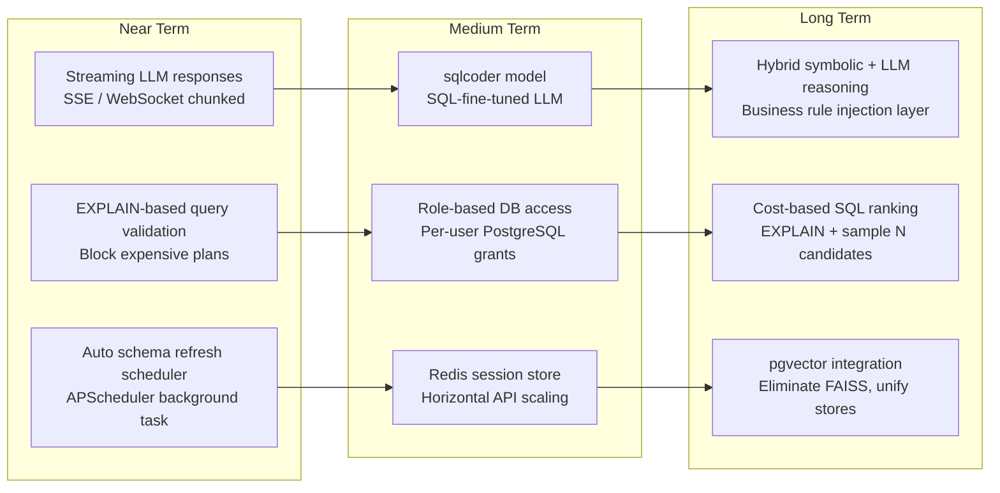

### 14.2 Improvement Details

**Streaming Responses**: FastAPI supports Server-Sent Events and WebSocket streaming. Ollama's `/api/generate` supports `stream: true`, yielding partial tokens. The path is: streaming Ollama call → forward tokens through WebSocket → render progressively in Streamlit using `st.write_stream()`. This would eliminate the 40-second silent wait.

**Query Plan Verification**: Before executing, run `EXPLAIN` (no `ANALYZE`) to check that the query plan uses expected indexes, that estimated row counts are reasonable, and there are no full sequential scans on large tables. Expensive plans should be flagged or blocked.

**Cost-Based SQL Ranking**: Sample N candidate SQL queries (via temperature sampling) and select the cheapest by estimated execution cost from `EXPLAIN`. More reliable than single-shot generation.

**Hybrid Symbolic + LLM Reasoning**: Encode domain business rules (e.g., "active" = `status NOT IN ('archived', 'cancelled')`) as SQL fragments that are injected into the prompt when relevant business terms are detected. Reduces LLM reliance on training data for domain knowledge.

**Auto Schema Refresh**: A background APScheduler task detects schema changes in `information_schema` and triggers incremental re-embedding of modified tables without requiring an API restart.

**Role-Based Database Access**: Route queries through different PostgreSQL users based on the API caller's role — analyst gets full SELECT, restricted user gets SELECT on masked views only. Requires session-level user context and per-role credentials.

---

*TalkWithDB – Chat with SQL Assignment Report | OneClarity Internship Evaluation | 18 - 21 February 2026*  
*Author: Vedanshi dabbawala | github.com/Vedanshitr20*
