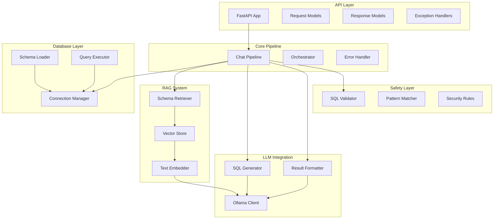
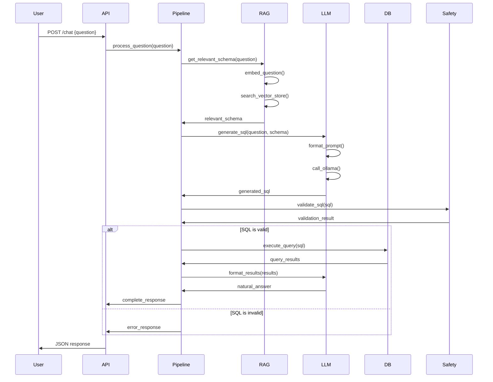
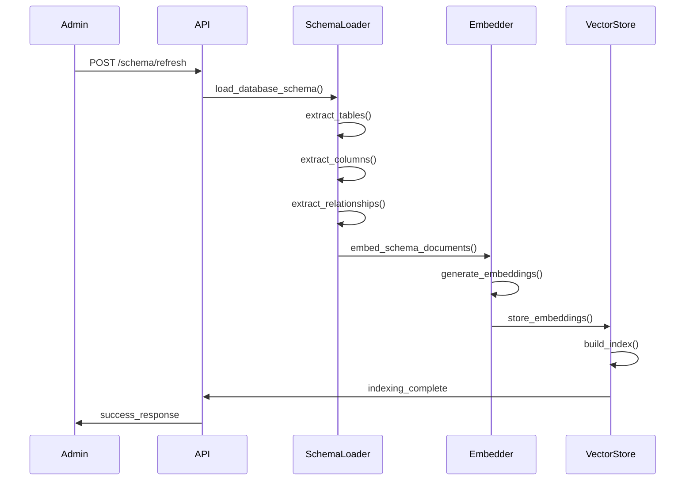

# System Design Documentation

## Overview

The Chat with SQL system is designed as a modular, production-ready application that converts natural language questions into safe SQL queries using Retrieval-Augmented Generation (RAG). This document explains the architectural decisions, component interactions, and design patterns used.

## Architecture Principles

### 1. Separation of Concerns
Each module has a single responsibility:
- **API Layer**: HTTP handling and request/response formatting
- **Core Pipeline**: Orchestration and business logic
- **Database Layer**: Data access and schema management
- **RAG System**: Information retrieval and embedding
- **LLM Integration**: Language model interactions
- **Safety Layer**: Security and validation

### 2. Dependency Injection
Components are loosely coupled through dependency injection, making the system testable and modular.

### 3. Configuration Management
All configuration is externalized through environment variables and configuration files.

### 4. Error Handling
Comprehensive error handling at each layer with proper logging and user-friendly error messages.

## Component Architecture



## Data Flow

### 1. Request Processing Flow



### 2. Schema Indexing Flow



## Technology Stack

### Core Technologies

- **Python 3.8+**: Primary programming language
- **FastAPI**: Web framework for API layer
- **PostgreSQL**: Primary database
- **Ollama**: Local LLM serving
- **FAISS**: Vector similarity search

### Key Libraries

- **psycopg2**: PostgreSQL database adapter
- **pydantic**: Data validation and settings management
- **numpy**: Numerical computations
- **sentence-transformers**: Text embeddings (via Ollama)
- **uvicorn**: ASGI server

## Design Patterns

### 1. Repository Pattern
The database layer implements the repository pattern for data access abstraction.

```python
class DatabaseConnection:
    def __init__(self, config: DatabaseConfig):
        self.config = config
        self.pool = None
    
    def execute_query(self, sql: str, params: dict = None) -> List[dict]:
        """Execute SQL query and return results."""
        pass
    
    def get_schema(self) -> DatabaseSchema:
        """Extract database schema."""
        pass
```

### 2. Strategy Pattern
The safety layer uses strategy pattern for different validation rules.

```python
class ValidationRule:
    def validate(self, sql: str) -> ValidationResult:
        pass

class SelectOnlyRule(ValidationRule):
    def validate(self, sql: str) -> ValidationResult:
        # Implementation
        pass

class InjectionDetectionRule(ValidationRule):
    def validate(self, sql: str) -> ValidationResult:
        # Implementation
        pass
```

### 3. Factory Pattern
The LLM integration uses factory pattern for different model types.

```python
class LLMFactory:
    @staticmethod
    def create_generator(model_type: str) -> SQLGenerator:
        if model_type == "ollama":
            return OllamaSQLGenerator()
        # Add other providers as needed
```

## Security Architecture

### 1. SQL Injection Prevention
- Input validation and sanitization
- Parameterized queries
- SQL pattern detection
- Query complexity limits

### 2. Access Control
- Database connection isolation
- Read-only user permissions
- Query result limits
- Timeout protections

### 3. Data Protection
- No sensitive data in logs
- Environment variable encryption
- Secure credential management

## Performance Considerations

### 1. Caching Strategy
- **Schema Embeddings**: Cached in FAISS vector store
- **Database Connections**: Connection pooling
- **LLM Responses**: Response caching for identical queries

### 2. Scalability Design
- **Horizontal Scaling**: Stateless API design
- **Database Scaling**: Read replicas for query execution
- **LLM Scaling**: Multiple Ollama instances

### 3. Resource Management
- **Memory**: Efficient vector operations
- **CPU**: Async processing for I/O operations
- **Network**: Connection pooling and keep-alive

## Error Handling Strategy

### 1. Layered Error Handling
```python
try:
    # Business logic
    result = process_request()
except DatabaseError as e:
    logger.error(f"Database error: {e}")
    raise HTTPException(500, "Database operation failed")
except ValidationError as e:
    logger.warning(f"Validation error: {e}")
    raise HTTPException(400, str(e))
except Exception as e:
    logger.error(f"Unexpected error: {e}")
    raise HTTPException(500, "Internal server error")
```

### 2. Error Classification
- **User Errors**: Invalid input, malformed questions
- **System Errors**: Database connection, LLM unavailability
- **Security Errors**: SQL injection attempts, access violations

### 3. Recovery Mechanisms
- **Automatic Retry**: For transient failures
- **Circuit Breaker**: For external service failures
- **Graceful Degradation**: Fallback responses

## Monitoring and Observability

### 1. Logging Strategy
- **Structured Logging**: JSON format with correlation IDs
- **Log Levels**: DEBUG, INFO, WARNING, ERROR, CRITICAL
- **Log Aggregation**: Centralized log collection

### 2. Metrics Collection
- **Request Metrics**: Response time, error rate, throughput
- **Database Metrics**: Query time, connection pool usage
- **LLM Metrics**: Token usage, response time, model performance

### 3. Health Checks
- **Application Health**: Service availability
- **Database Health**: Connection status, query performance
- **LLM Health**: Model availability, response time

## Deployment Architecture

### 1. Container Strategy
- **Application Container**: Python runtime with dependencies
- **Database Container**: PostgreSQL with persistent storage
- **LLM Container**: Ollama with GPU support

### 2. Orchestration
- **Docker Compose**: Local development
- **Kubernetes**: Production deployment
- **Service Mesh**: Advanced networking and observability

### 3. Configuration Management
- **Environment Variables**: Runtime configuration
- **ConfigMaps**: Application configuration
- **Secrets**: Sensitive data management

## Future Enhancements

### 1. Multi-Database Support
- **MySQL**: Additional database adapter
- **SQLite**: Lightweight database option
- **NoSQL**: Document database support

### 2. Advanced RAG Features
- **Hybrid Search**: Combine vector and keyword search
- **Query Understanding**: Intent classification and entity recognition
- **Context Management**: Conversation history and context

### 3. Enterprise Features
- **Authentication**: User management and RBAC
- **Audit Logging**: Query history and compliance
- **Multi-tenancy**: Isolated user environments

## Conclusion

This architecture provides a solid foundation for a production-ready natural language to SQL system. The modular design allows for easy extension and maintenance while ensuring security and performance.

The key strengths of this architecture are:
- **Modularity**: Clear separation of concerns
- **Security**: Multiple layers of protection
- **Performance**: Optimized for real-time responses
- **Scalability**: Designed for growth and expansion
- **Maintainability**: Clean code and comprehensive documentation
