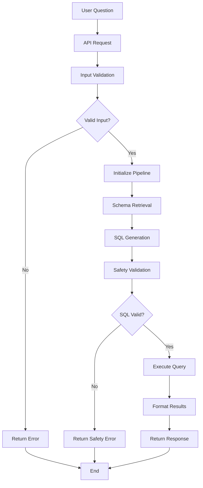
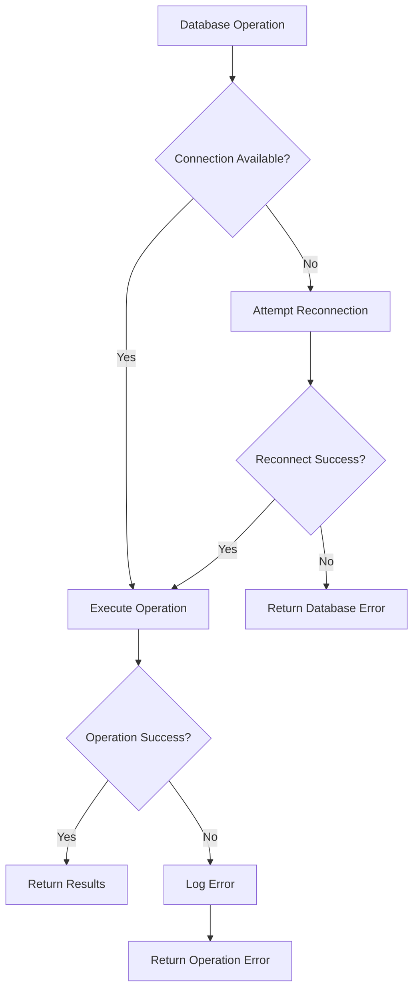
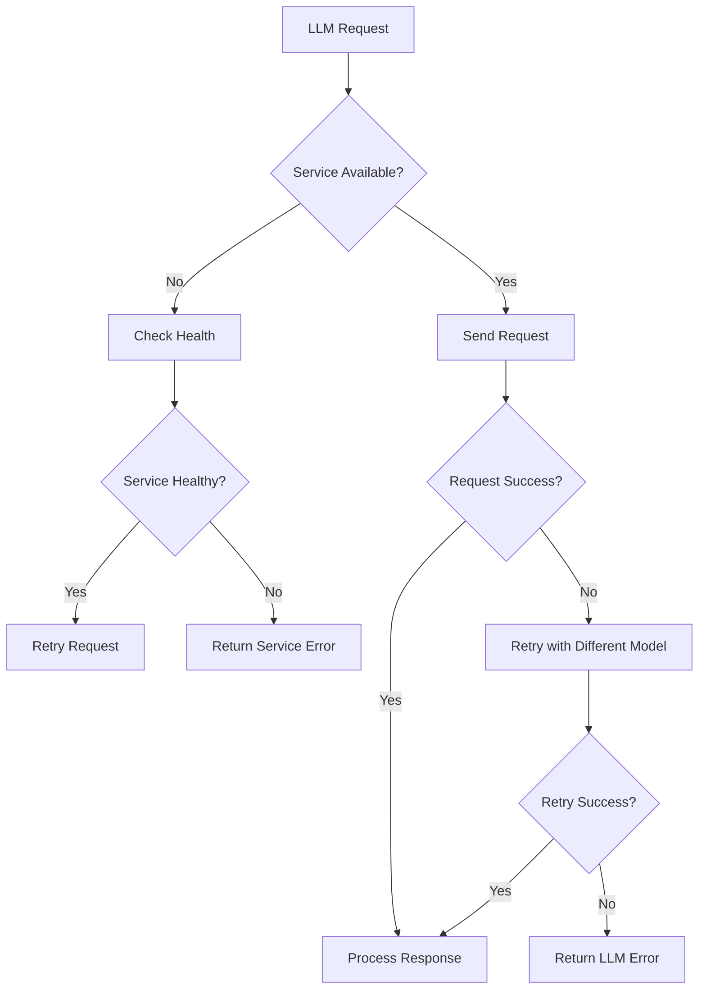
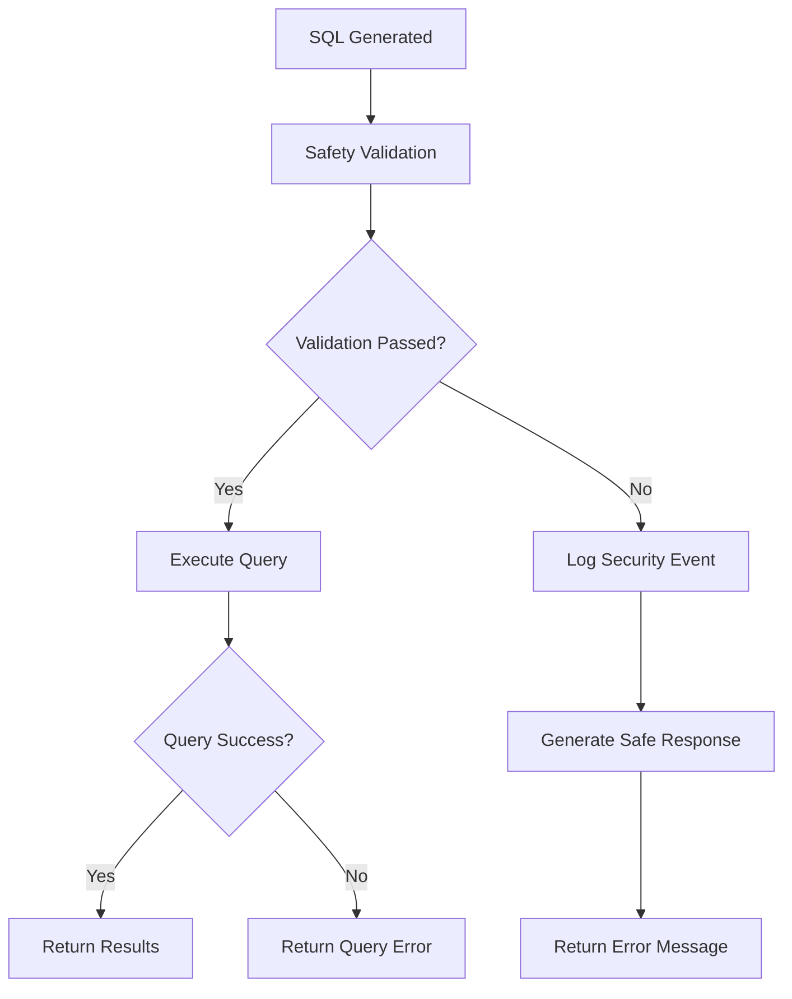
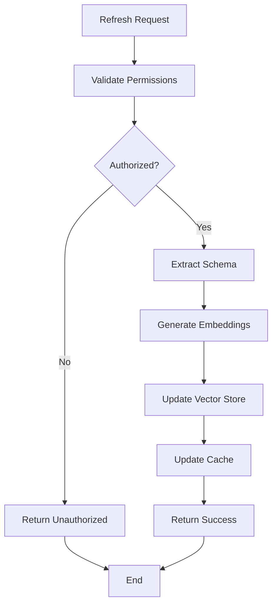

# Workflow Documentation

## Overview

This document describes the complete workflow of the Chat with SQL system, from user input to final response. It covers both the happy path scenarios and error handling workflows.

## Main Query Processing Workflow

### 1. User Request Flow



### 2. Detailed Step-by-Step Workflow

#### Step 1: Request Reception and Validation

**Location**: `src/chat_sql/api/app.py`

```python
async def chat_with_sql(request: ChatRequest):
    # 1. Input validation
    if not request.question or not request.question.strip():
        raise HTTPException(400, "Question cannot be empty")
    
    # 2. Length validation
    if len(request.question) > config.MAX_QUESTION_LENGTH:
        raise HTTPException(400, "Question too long")
    
    # 3. Basic pattern validation
    if contains_suspicious_patterns(request.question):
        raise HTTPException(400, "Invalid question format")
```

**Validation Rules**:
- Question cannot be empty or whitespace only
- Maximum length: 500 characters (configurable)
- No SQL injection patterns in the question
- Basic profanity filter (optional)

#### Step 2: Pipeline Initialization

**Location**: `src/chat_sql/core/chat_with_sql.py`

```python
class ChatWithSQLPipeline:
    def __init__(self):
        self.db_connection = DatabaseConnection()
        self.schema_retriever = SchemaRetriever()
        self.sql_generator = SQLGenerator()
        self.sql_validator = SQLValidator()
        self.result_formatter = ResultFormatter()
    
    def chat_with_sql(self, question: str) -> dict:
        # Initialize context
        context = PipelineContext(
            question=question,
            timestamp=datetime.now(),
            correlation_id=str(uuid.uuid4())
        )
        
        return self._process_question(context)
```

#### Step 3: Schema Retrieval (RAG)

**Location**: `src/chat_sql/rag/retriever.py`

**Sub-steps**:

1. **Question Embedding**
```python
def embed_question(self, question: str) -> np.ndarray:
    # Clean and preprocess question
    cleaned_question = self._preprocess_text(question)
    
    # Generate embedding using Ollama
    embedding = self.embedder.embed(cleaned_question)
    
    return embedding
```

2. **Vector Search**
```python
def search_similar_schema(self, question_embedding: np.ndarray, top_k: int = 5):
    # Search FAISS index
    distances, indices = self.vector_store.search(question_embedding, top_k)
    
    # Retrieve schema documents
    relevant_schema = []
    for distance, idx in zip(distances, indices):
        schema_doc = self.vector_store.get_document(idx)
        relevant_schema.append({
            'schema': schema_doc,
            'similarity': 1 - distance  # Convert distance to similarity
        })
    
    return relevant_schema
```

3. **Schema Filtering and Ranking**
```python
def rank_schema_documents(self, question: str, schema_candidates: list) -> list:
    # Calculate relevance scores
    scored_candidates = []
    for candidate in schema_candidates:
        score = self._calculate_relevance_score(question, candidate)
        scored_candidates.append({
            **candidate,
            'relevance_score': score
        })
    
    # Sort by relevance and return top-k
    return sorted(scored_candidates, key=lambda x: x['relevance_score'], reverse=True)[:self.top_k]
```

**Relevance Scoring Factors**:
- Semantic similarity (vector similarity)
- Keyword overlap
- Table/column name matching
- Contextual relevance

#### Step 4: SQL Generation

**Location**: `src/chat_sql/llm/sql_generator.py`

**Sub-steps**:

1. **Prompt Construction**
```python
def construct_prompt(self, question: str, schema_context: list) -> str:
    prompt_template = """
    You are a SQL expert. Convert the following natural language question to SQL.
    
    Database Schema:
    {schema_context}
    
    Question: {question}
    
    Requirements:
    - Generate only SELECT queries
    - Use proper table joins
    - Include LIMIT clause (max 200 rows)
    - Use proper column names from schema
    - Handle NULL values appropriately
    
    SQL Query:
    """
    
    schema_text = self._format_schema_for_prompt(schema_context)
    return prompt_template.format(
        schema_context=schema_text,
        question=question
    )
```

2. **LLM Call**
```python
def generate_sql(self, prompt: str) -> str:
    try:
        response = self.ollama_client.generate(
            model=self.model_name,
            prompt=prompt,
            options={
                'temperature': 0.1,  # Low temperature for consistent SQL
                'max_tokens': 500,
                'stop': [';', '\n\n']
            }
        )
        
        sql_query = self._extract_sql_from_response(response['response'])
        return sql_query.strip()
        
    except Exception as e:
        raise SQLGenerationError(f"Failed to generate SQL: {str(e)}")
```

3. **SQL Extraction and Cleaning**
```python
def _extract_sql_from_response(self, response: str) -> str:
    # Remove markdown code blocks
    response = re.sub(r'```sql\s*', '', response)
    response = re.sub(r'```\s*', '', response)
    
    # Extract SQL using regex
    sql_pattern = r'(SELECT\s+.*?)(?:\s*;|\s*$)'
    matches = re.findall(sql_pattern, response, re.IGNORECASE | re.DOTALL)
    
    if matches:
        return matches[0].strip()
    else:
        raise SQLGenerationError("No valid SQL found in response")
```

#### Step 5: Safety Validation

**Location**: `src/chat_sql/safety/sql_validator.py`

**Validation Layers**:

1. **SQL Type Validation**
```python
def validate_sql_type(self, sql: str) -> ValidationResult:
    # Check if it's a SELECT query
    if not re.match(r'^\s*SELECT\s', sql, re.IGNORECASE):
        return ValidationResult(
            is_valid=False,
            error="Only SELECT queries are allowed",
            risk_level="HIGH"
        )
    
    return ValidationResult(is_valid=True)
```

2. **Injection Pattern Detection**
```python
def detect_injection_patterns(self, sql: str) -> ValidationResult:
    dangerous_patterns = [
        r'(\bOR\b\s+\d+\s*=\s*\d+)',  # OR 1=1
        r'(--|#)',                    # SQL comments
        r'(\bUNION\b.*\bSELECT\b)',   # UNION attacks
        r'(\bDROP\b|\bDELETE\b|\bUPDATE\b|\bINSERT\b)',  # DML
        r'(\bEXEC\b|\bEXECUTE\b)',    # Dynamic SQL
    ]
    
    for pattern in dangerous_patterns:
        if re.search(pattern, sql, re.IGNORECASE):
            return ValidationResult(
                is_valid=False,
                error=f"Dangerous SQL pattern detected: {pattern}",
                risk_level="CRITICAL"
            )
    
    return ValidationResult(is_valid=True)
```

3. **System Table Protection**
```python
def validate_table_access(self, sql: str) -> ValidationResult:
    # Extract table names
    tables = self._extract_table_names(sql)
    
    # Check against system tables
    system_tables = [
        'pg_user', 'pg_tables', 'information_schema',
        'mysql.user', 'sys.tables', 'sqlite_master'
    ]
    
    for table in tables:
        if any(sys_table in table.lower() for sys_table in system_tables):
            return ValidationResult(
                is_valid=False,
                error=f"Access to system table '{table}' is not allowed",
                risk_level="HIGH"
            )
    
    return ValidationResult(is_valid=True)
```

4. **Query Complexity Analysis**
```python
def analyze_query_complexity(self, sql: str) -> ValidationResult:
    # Count JOIN operations
    join_count = len(re.findall(r'\bJOIN\b', sql, re.IGNORECASE))
    
    # Count subqueries
    subquery_count = len(re.findall(r'\bSELECT\b.*\bFROM\b', sql, re.IGNORECASE))
    
    # Check for excessive complexity
    if join_count > 5 or subquery_count > 3:
        return ValidationResult(
            is_valid=False,
            error="Query too complex - too many JOINs or subqueries",
            risk_level="MEDIUM"
        )
    
    return ValidationResult(is_valid=True)
```

#### Step 6: Query Execution

**Location**: `src/chat_sql/db/connection.py`

**Execution Process**:

1. **Query Preparation**
```python
def prepare_query(self, sql: str) -> str:
    # Ensure LIMIT clause
    if 'LIMIT' not in sql.upper():
        sql += f" LIMIT {self.config.MAX_RESULT_ROWS}"
    
    # Add timeout
    sql = f"SET statement_timeout TO {self.config.SQL_TIMEOUT_SECONDS * 1000}; {sql}"
    
    return sql
```

2. **Execution with Timeout**
```python
def execute_query(self, sql: str, params: dict = None) -> QueryResult:
    start_time = time.time()
    
    try:
        with self.connection.cursor() as cursor:
            cursor.execute(sql, params or {})
            results = cursor.fetchall()
            execution_time = int((time.time() - start_time) * 1000)
            
            return QueryResult(
                data=results,
                execution_time_ms=execution_time,
                row_count=len(results),
                success=True
            )
            
    except Exception as e:
        execution_time = int((time.time() - start_time) * 1000)
        
        return QueryResult(
            data=[],
            execution_time_ms=execution_time,
            row_count=0,
            success=False,
            error=str(e)
        )
```

#### Step 7: Result Formatting

**Location**: `src/chat_sql/llm/result_formatter.py`

**Formatting Process**:

1. **Result Analysis**
```python
def analyze_results(self, results: list) -> ResultAnalysis:
    if not results:
        return ResultAnalysis(
            has_data=False,
            message="No results found for your query."
        )
    
    # Analyze data patterns
    analysis = {
        'row_count': len(results),
        'column_count': len(results[0]) if results else 0,
        'data_types': self._infer_data_types(results),
        'summary_stats': self._calculate_summary_stats(results)
    }
    
    return ResultAnalysis(
        has_data=True,
        analysis=analysis
    )
```

2. **Natural Language Generation**
```python
def generate_natural_response(self, question: str, sql: str, results: list) -> str:
    prompt_template = """
    Given the user question, SQL query, and results, provide a natural language answer.
    
    Question: {question}
    SQL Query: {sql}
    Results: {results}
    
    Provide a clear, concise answer in natural language. If no results were found, say so.
    """
    
    response = self.ollama_client.generate(
        model=self.model_name,
        prompt=prompt_template.format(
            question=question,
            sql=sql,
            results=self._format_results_for_prompt(results)
        ),
        options={'temperature': 0.3}
    )
    
    return response['response'].strip()
```

## Error Handling Workflows

### 1. Database Connection Errors



**Error Recovery Strategies**:
- **Connection Pool**: Automatic reconnection
- **Circuit Breaker**: Fail fast after repeated failures
- **Retry Logic**: Exponential backoff for transient errors

### 2. LLM Service Errors



**Fallback Strategies**:
- **Model Fallback**: Try alternative models
- **Template Responses**: Pre-defined responses for common queries
- **Graceful Degradation**: Simplified functionality

### 3. Safety Validation Failures



**Security Response**:
- **Event Logging**: All security violations logged
- **User Feedback**: Clear error messages without revealing system details
- **Rate Limiting**: Temporary restrictions for repeated violations

## Schema Refresh Workflow

### 1. Manual Schema Refresh



### 2. Automatic Schema Detection

```python
def detect_schema_changes(self) -> bool:
    # Get current schema hash
    current_hash = self._calculate_schema_hash()
    
    # Compare with stored hash
    stored_hash = self.get_stored_schema_hash()
    
    if current_hash != stored_hash:
        self._trigger_schema_refresh()
        return True
    
    return False
```

## Monitoring and Logging Workflow

### 1. Request Logging

```python
@log_request
def process_request(self, question: str):
    correlation_id = str(uuid.uuid4())
    
    logger.info("Request started", extra={
        'correlation_id': correlation_id,
        'question': question,
        'timestamp': datetime.now().isoformat()
    })
    
    try:
        result = self._process_question(question)
        
        logger.info("Request completed", extra={
            'correlation_id': correlation_id,
            'execution_time_ms': result['metadata']['execution_time'],
            'result_count': len(result['results'])
        })
        
        return result
        
    except Exception as e:
        logger.error("Request failed", extra={
            'correlation_id': correlation_id,
            'error': str(e),
            'error_type': type(e).__name__
        })
        raise
```

### 2. Performance Monitoring

```python
@monitor_performance
def execute_query(self, sql: str):
    start_time = time.time()
    
    try:
        result = self._execute_query(sql)
        
        metrics = {
            'execution_time_ms': int((time.time() - start_time) * 1000),
            'row_count': len(result.data),
            'success': True
        }
        
        self.metrics_collector.record_query_metrics(metrics)
        return result
        
    except Exception as e:
        metrics = {
            'execution_time_ms': int((time.time() - start_time) * 1000),
            'success': False,
            'error_type': type(e).__name__
        }
        
        self.metrics_collector.record_query_metrics(metrics)
        raise
```

## Configuration Workflow

### 1. Environment Configuration Loading

```python
def load_configuration(self):
    # Load from environment variables
    config = {
        'ollama_base_url': os.getenv('OLLAMA_BASE_URL', 'http://localhost:11434'),
        'ollama_llm_model': os.getenv('OLLAMA_LLM_MODEL', 'llama3.2'),
        'database_url': os.getenv('DATABASE_URL'),
        'max_result_rows': int(os.getenv('MAX_RESULT_ROWS', '200')),
    }
    
    # Validate required configuration
    self._validate_config(config)
    
    return config
```

### 2. Runtime Configuration Updates

```python
def update_configuration(self, new_config: dict):
    # Validate new configuration
    self._validate_config(new_config)
    
    # Update running configuration
    self.config.update(new_config)
    
    # Restart affected components
    if 'database_url' in new_config:
        self._restart_database_connection()
    
    if 'ollama_base_url' in new_config:
        self._restart_llm_client()
```

## Conclusion

This workflow documentation provides a comprehensive view of how the Chat with SQL system processes requests, handles errors, and maintains system health. The modular design allows for easy debugging, monitoring, and optimization of each component in the pipeline.

Key workflow characteristics:
- **Resilience**: Comprehensive error handling and recovery
- **Security**: Multiple validation layers
- **Performance**: Optimized for real-time responses
- **Observability**: Detailed logging and monitoring
- **Flexibility**: Configurable and extensible design
